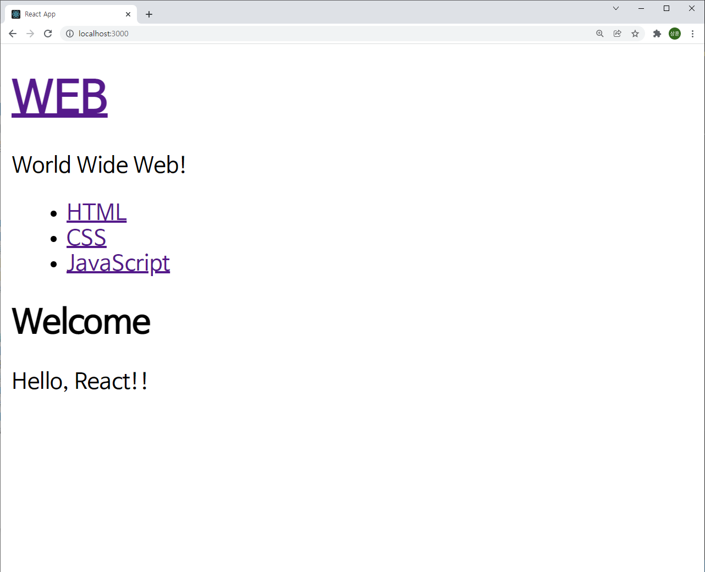
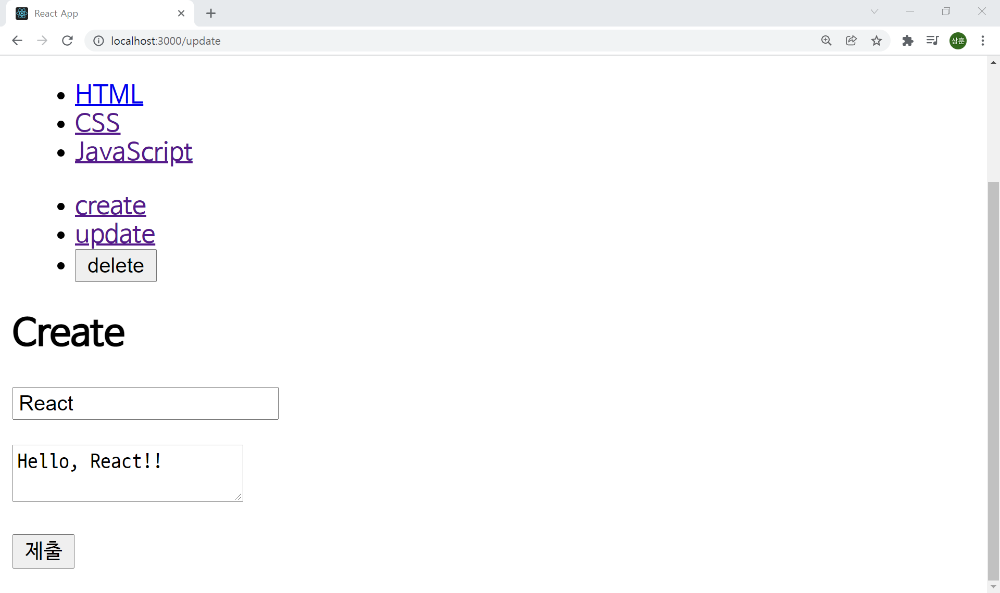
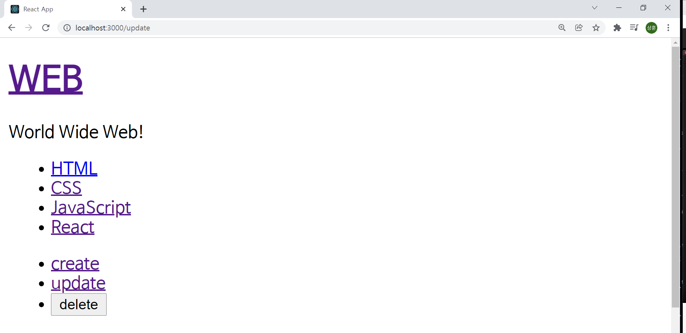

# React

React 공부용 Repository

참조 : [생활코딩-React](https://www.youtube.com/playlist?list=PLuHgQVnccGMCRv6f8H9K5Xwsdyg4sFSdi)


## 목차

1. [시작하기](#시작하기)
2. [새로운 React 앱 만들기](#새로운-React-앱-만들기)
3. [JavaScript](#JavaScript)
4. [CSS](#CSS)
5. [배포](#배포)
6. [Component](#Component)
7. [Props](#Props)
8. [Component 파일로 분리하기](#Component-파일로-분리하기)
9. [State](#State)
10. [Key](#Key)
11. [state, props, render](#state,-props,-render)
12. [event](#event)
12. [component event](#component-event)


## 시작하기

먼저 npm을 이용하여 `create-react-app`을 설치해야 한다.

이 [링크](https://nodejs.org/ko/)에서 node.js를 다운 받아 설치하고 시작하자.

```bash
npm -v
```

위 명령어를 `bash`에 입력하여 설치가 완료되었는지 확인한다.

```bash
npm install -g create-react-app
```

위 명령어를 입력하여 `create-react-app`을 설치한다. `-g`는 이 컴퓨터의 모든 환경에 설치한다는 뜻이다. 가상환경을 사용한다면 입력하지 않아도 된다.


## 새로운 React 앱 만들기

React 앱을 만들고자 하는 디렉토리로 이동하여 아래와 같은 명령어를 입력한다.

```bash
npm create-react-app react-app
cd react-app
npm start
```

성공적으로 작업하였다면 아래와 같은 화면이 나올 것이다.


## JavaScript

```html
<!-- index.html -->	
	...

<body>
  <noscript>You need to enable JavaScript to run this app.</noscript>
  <div id="root"></div>
</body>

	...

```

이 부분을 찾을 수 있다. 이것이 의미하는 것은 화면에 보여지는 `index.html`의 body id가 'root'인 컴포넌트가 존재한다는 뜻이다. 이를 `index.js`에서 조작할 수 있다.


```javascript
// index.js

import React from 'react';
import ReactDOM from 'react-dom';
import './index.css';
import App from './App';
import reportWebVitals from './reportWebVitals';

ReactDOM.render(
  <React.StrictMode>
    <App />
  </React.StrictMode>,
  document.getElementById('root')
);

// If you want to start measuring performance in your app, pass a function
// to log results (for example: reportWebVitals(console.log))
// or send to an analytics endpoint. Learn more: https://bit.ly/CRA-vitals
reportWebVitals();

```

여기서도 마찬가지로 `root`컴포넌트에 `App.js`로 조작된 컴포넌트를 입력시켜 줄 수 있다.


```javascript
// App.js

import logo from './logo.svg';
import './App.css';

function App() {
  return (
    <div className="App">
      <header className="App-header">
        
        <p>
          Edit <code>src/App.js</code> and save to reload.
        </p>
        <a
          className="App-link"
          href="https://reactjs.org"
          target="_blank"
          rel="noopener noreferrer"
        >
          Learn React
        </a>
      </header>
    </div>
  );
}

export default App;

```


그렇기 때문에 위 코드를 아래와 같이 바꿔준다면

```javas
import './App.css';

function App() {
  return (
    <div className="App">
		hello world!!
    </div>
  );
}

export default App;

```


이처럼 조작할 수 있다.


## CSS

```css
/* index.css */

body {
  margin: 0;
  font-family: -apple-system, BlinkMacSystemFont, 'Segoe UI', 'Roboto', 'Oxygen',
    'Ubuntu', 'Cantarell', 'Fira Sans', 'Droid Sans', 'Helvetica Neue',
    sans-serif;
  -webkit-font-smoothing: antialiased;
  -moz-osx-font-smoothing: grayscale;
}

code {
  font-family: source-code-pro, Menlo, Monaco, Consolas, 'Courier New',
    monospace;
}
```

초기에는 위와 같이 설정되어 있다. 이를 

```css
body{
  background-color: powderblue;
}
```

위 처럼 수정한다면 아래와 같이 변경됨을 알 수 있다.


## 배포

로컬에서 React를 실행하는 것과 같이 배포할 때도 똑같이 하게 된다면 React개발자용 파일과 같이 용량이 커지고 보안상의 문제가 발생할 수 있다. 이를 막기위해 다음과 같은 작업을 수행한다.

```bash
npm run build
```

이 명령어로 배포용 `build`를 생성해 준다. 그리고 서버로 배포하기 위해 다음과 같은 명령어를 입력한다.

```bash
npm install -g serve
serve -s build
```


## Component

먼저 만들고자하는 문서를 html로 만들어 보자

```html
<!-- pure.html -->

<html>
  <body>
    <header>
      <h1>Web</h1>
      world wide Web!
    </header>

    <nav>
      <ul>
        <li><a href="1.html">HTML</a></li>
        <li><a href="2.html">CSS</a></li>
        <li><a href="3.html">JavaScript</a></li>
      </ul>
    </nav>
    
    <article>
      <h2>HTML</h2>
      HTML is HyperText Markup Language.
    </article>
  </body>
</html>
```

위와 같은 코드를 실행한다면 아래와 같은 모습의 웹페이지를 기대할 수 있다.


이를 컴포넌트를 이용해 바꾸어 보자.


### Header

App.js의 코드를 다음과 같이 변경해 보자.

```javascript
class Header extends Component {
  render () {
    return (
      <header>
        <h1>Web</h1>
        world wide Web!
      </header>
    );
  }
}

class App extends Component {
  render () {
    return (
      <div className="App">
        <Header/>
      </div>
    );
  }
}

```

`Subject`라는 클래스 함수를 생성하여 기존의 html에서 header부분을 렌더링 하도록 만들자. 그리고 그 `Subject` 클래스 함수를 `App` 클래스 함수에서 렌더링 할 수 있도록 해주면 다음과 같은 결과를 만들 수 있다.


### Navbar

```javascript
class Navbar extends Component {
  render () {
    return (
      <nav>
        <ul>
          <li><a href="1.html">HTML</a></li>
          <li><a href="2.html">CSS</a></li>
          <li><a href="3.html">JavaScript</a></li>
        </ul>
      </nav>
    );
  }
}
```


### Article

```javascript
class Article extends Component {
  render () {
    return (
      <article>
        <h2>HTML</h2>
        HTML is HyperText Markup Language.
      </article>
    );
  }
}
```


### App

```javascript
class App extends Component {
  render () {
    return (
      <div className="App">
        <Header/>
        <Navbar/>
        <Article/>
      </div>
    );
  }
}
```

마찬가지로 각 클래스를 생성하고 `App`클래스를 수정해 주면 html로 작성한 화면과 동일한 페이지를 얻을 수 있다.


## Props

`App`에서 각 클래스의 값을 변경시켜 주어 사용하고 싶다. 이러한 경우 사용하는 것이 `Props`이다.

```javascript
class Header extends Component {
  render () {
    return (
      <header>
        <h1>{this.props.title}</h1>
        {this.props.sub}
      </header>
    );
  }
}

class App extends Component {
  render () {
    return (
      <div className="App">
        <Header title="WEB" sub="world wide web!"/>
        <Navbar/>
        <Article/>
      </div>
    );
  }
}
```


위와 같이 변경하여도 같은 결과 값이 나올 것이다. 만약 `App`클래스를 다음과 같이 변경한다면

```javascript
class App extends Component {
  render () {
    return (
      <div className="App">
        <Header title="WEB" sub="world wide web!"/>
        <Header title="React" sub="For UI"/>
        <Navbar/>
        <Article/>
      </div>
    );
  }
}
```


이러한 결과를 얻을 수 있다.


## Component 파일로 분리하기

이렇게 작성을 하게 되면 `App.js`파일에 작성된 내용이 너무 많아진다. 그리고 기능적으로 다른 컴포넌트들이 한꺼번에 있어 알아보기도 쉽지 않고 유지 보수가 힘들어진다. 이를 위해서 컴포넌트 폴더를 따로 생성하여 분리시켜 준다.


그리고 각 파일들을 이렇게 작성해 준다.

```javascript
// Header.js

import React, { Component } from 'react';


class Header extends Component {
  render () {
    return (
      <header>
        <h1>{this.props.title}</h1>
        {this.props.sub}
      </header>
    );
  }
}

export default Header;
```


```javascript
// Navbar.js

import React, { Component } from 'react';


class Navbar extends Component {
  render () {
    return (
      <nav>
        <ul>
          <li><a href="1.html">HTML</a></li>
          <li><a href="2.html">CSS</a></li>
          <li><a href="3.html">JavaScript</a></li>
        </ul>
      </nav>
    );
  }
}

export default Navbar;
```


```javascript
// Article.js

import React, { Component } from 'react';


class Article extends Component {
  render () {
    return (
      <article>
        <h2>{this.props.title}</h2>
        {this.props.desc}
      </article>
    );
  }
}

export default Article;
```


```javascript
// App.js

import React, { Component } from 'react';
import Header from "./components/Navbar"
import Navbar from "./components/Navbar"
import Article from "./components/Navbar"
import './App.css';


class App extends Component {
  render () {
    return (
      <div className="App">
        <Header title="WEB" sub="world wide web!"/>
        <Navbar/>
        <Article title="HTML" desc="HTML is HyperText Markup Language."/>
      </div>
    );
  }
}

export default App;

```

이렇게 분리 시켜 준다면 한 기능에 오류가 생기거나 수정할 사항이 발생했을 때 기능이 얽히지 않아 유지 보수가 매우 편리해 진다.


## State

앱이 내부적으로 사용하는 구조를 갖기 위해서 상위 컴포넌트의 `state`를 하위 컴포넌트의 `props`로 데이터를 전달해 준다. 아래와 같이 수정해 줄 수 있다.

```javascript
// App.js

class App extends Component {
  constructor(props) {
    super(props);
    this.state = {
      header:{title:'WEB', sub:'World Wide Web!'}
    }
  }
  render () {
    return (
      <div className="App">
        <Header 
          title={this.state.header.title}
          sub={this.state.header.sub}
        />
        <Navbar/>
        <Article title="HTML" desc="HTML is HyperText Markup Language."/>
      </div>
    );
  }
}

```


## Key

`Navbar`도 변경해 보자. 리스트로 여러가지의 데이터를 받고 있기 때문에 주의해야 할 점이 있다. 각 리스트에 `key`값을 주어 React 내부에서 처리가 원활하도록 하자.

```javascript
// App.js

class App extends Component {
  constructor(props) {
    super(props);
    this.state = {
      header:{title:'WEB', sub:'World Wide Web!'},
      articles:[
        {id:1, title:'HTML', desc:'HTML is HyperText Markup Language.'},
        {id:2, title:'CSS', desc:'CSS is for desgin.'},
        {id:3, title:'JavaScript', desc:'JavaScript is for interactive.'},
      ]
    }
  }
  render () {
    return (
      <div className="App">
        <Header 
          title={this.state.header.title}
          sub={this.state.header.sub}
        />
        <Navbar data={this.state.articles}/>
        <Article title="HTML" desc="HTML is HyperText Markup Language."/>
      </div>
    );
  }
}

// Navbar.js

class Navbar extends Component {
  render () {
    var lists = [];
    var data = this.props.data;
    var i = 0;
    while(i < data.length) {
      lists.push(<li key={data[i].id}><a href={"/content/"+data[i].id}>{data[i].title}</a></li>);
      i = i + 1;
    }
    return (
      <nav>
        <ul>
          {lists}
        </ul>
      </nav>
    );
  }
}
```


## state, props, render

이번에는 위의 모든 기능을 활용해 보자. 부모 컴포넌트의 `state`값에 따라 다른 데이터를 `props`로 받아와 `render`하는 실습을 해 보았다.

```javascript
// App.js

class App extends Component {
  constructor(props) {
    super(props);
    this.state = {
      mode: 'welcome',
      header: {title:'WEB', sub:'World Wide Web!'},
      welcome: {title:'Welcome', desc:'Hello, React!!'},
      articles:[
        {id:1, title:'HTML', desc:'HTML is HyperText Markup Language.'},
        {id:2, title:'CSS', desc:'CSS is for desgin.'},
        {id:3, title:'JavaScript', desc:'JavaScript is for interactive.'},
      ]
    }
  }
  render () {
    console.log('App render')
    var _title, _desc = null;
    if (this.state.mode === 'welcome') {
      _title = this.state.welcome.title;
      _desc = this.state.welcome.desc;
    } else if (this.state.mode === 'read') {
      _title = this.state.articles[0].title;
      _desc = this.state.articles[0].desc;
    }
    return (
      <div className="App">
        <Header 
          title={this.state.header.title}
          sub={this.state.header.sub}
        />
        <Navbar data={this.state.articles}/>
        <Article title={_title} desc={_desc}/>
      </div>
    );
  }
}
```

`render`함수와 `state`를 살펴 보면 `state.mode`값에 따라 다른 데이터를 받아와 props에 건네 주는 것을 알 수 있다.


`state.mode`가 welcome인 경우 state 내부의 welcome의 title과 desc를 각각 받아와 `props`에 건네준다. 따라서 위와 같은 화면이 출력된다.


`state.mode`가 read인 경우 state 내부의 articles의 0번째의 title과 desc를 각각 받아와 `props`에 건네준다. 따라서 위와 같은 화면이 출력된다. 이 경우에는 동적으로 변환시켜 navbar의 링크를 클릭할 때 변화를 줄 수 있겠다.


## event

`event`를 이용하여 state를 변경해 보자.

```javascript
// App.js

return (
      <div className="App">
        <header>
          <h1><a href="/" onClick={function(event) {
            console.log(event);
            event.preventDefault();
            this.setState({
              mode:'welcome'
            });
          }.bind(this)}>{this.state.header.title}</a></h1>
          {this.state.header.sub}
        </header>
        <Navbar data={this.state.articles}/>
        <Article title={_title} desc={_desc}/>
      </div>
    );
```

`header`에 `onClick` event가 발생 했을 때 변화를 주게 하였다. `this.setState()` 함수로 현재 state를 변경시키고 `.bind(this)`로 묶어 준다.


웹 페이지에서 WEB 부분을 클릭하면 state가 변화하여 다음과 같이 바뀐다.




## component event

event 또한 사용자가  컴포넌트로 만들 수 있다. 한번 시도해 보자.

```javascript
// Header.js

class Header extends Component {
  render () {
    console.log('Header render')
    return (
      <header>
        <h1><a href="/" onClick={function (event) {
          event.preventDefault();
          this.props.onChangePage();
        }.bind(this)}>{this.props.title}</a></h1>
        {this.props.sub}
      </header>
    );
  }
}
```

`Header`에 `onClick` 이벤트가 발생하면 `onChangePage` 함수를 호출하도록 한다. 이 함수는 `App.js`에서 페이지를 바꿔주는 역할을 할 것이다.


```javascript
// App.js

<Header 
title={this.state.header.title}
sub={this.state.header.sub}
onChangePage={function () {
    this.setState({mode:'welcome'});
}.bind(this)}
/>
```

`Header` 컴포넌트 부분만 살펴보면 `onChangePage` 함수가 실행되면 state의 mode를 `welcome`으로 변경시킨다. 이렇게 컴포넌트 이벤트를 만들 수 있다. 이제 한번 `Navbar`도 변경해 보자.


```javascript
// Navbar.js

while(i < data.length) {
  lists.push(
  	<li key={data[i].id}>
  	  <a
      	href={"/content/"+data[i].id}
      	onClick={function (id, event) {
        	event.preventDefault();
            this.props.onChangePage(id);
        }.bind(this, data[i].id)}
      >{data[i].title}</a>
    </li>
  );
  i = i + 1;
}
```

`Navbar` 컴포넌트의 while 부분만 따로 보면, 각 요소를 클릭했을 때 `onChangePage` 이벤트를 호출하도록 설정하였다. 이 때 Navbar의 각 요소의 id 값을 App에 전달 하기 위해서 bind 함수에 묶어서 보내 줄 수 있다.


```javascript
// App.js

class App extends Component {
  constructor(props) {
    super(props);
    this.state = {
      mode: 'welcome',
      id: 0,
      header: {title:'WEB', sub:'World Wide Web!'},
      welcome: {title:'Welcome', desc:'Hello, React!!'},
      articles:[
        {id:0, title:'HTML', desc:'HTML is HyperText Markup Language.'},
        {id:1, title:'CSS', desc:'CSS is for desgin.'},
        {id:2, title:'JavaScript', desc:'JavaScript is for interactive.'},
      ]
    }
  }

```

먼저 state부분을 살펴보면 `selected_article_id`라는 요소를 하나 만들어 두고 기본값으로 0으로 한다. 이 요소는 선택된 id값을 저장하기 위함이다. 또 각 id를 0부터 시작하게 하여 article의 인덱스와 일치시킨다.


```javascript
  render () {
    var _title, _desc = null;
    if (this.state.mode === 'welcome') {
      
      ...
      
    } else if (this.state.mode === 'read') {
      _title = this.state.articles[this.state.id].title
      _desc = this.state.articles[this.state.id].desc
    }
    return (
      <div className="App">
		
        ...
        
        <Navbar
          onChangePage={function (id) {
            this.setState({
              mode:'read',
              id: Number(id)
            });
          }.bind(this)}
          data={this.state.articles}
        />
        <Article title={_title} desc={_desc}/>
      </div>
    );
  }
}
```

렌더링 되는 부분을 살펴보자. 먼저 `Navbar` 컴포넌트를 보면 state의 mode값이 `read`로 바뀌고 `id` 값을 자식 컴포넌트에서 받아온 id값이 숫자형으로 변환되어 저장한다. 이제 위의 if문을 보자. 선택된 id 값을 `변수 i` 에 저장하고 그 인덱스에 맞는 title과 desc를 저장하여 `Article` 컴포넌트에 전달해 주면 우리가 원하는 기능이 완성된다.


## create

먼저 control 컴포넌트를 생성하여 `App.js`에 추가하자.

```javascript
// Control.js

import React, { Component } from 'react';


class Control extends Component {
  render () {
    return (
      <ul>
        <li>
          <a 
            href="/create"
            onClick={function (event) {
              event.preventDefault();
              this.props.onChangeMode('create');
            }.bind(this)}
          >create</a>
        </li>
        <li>
          <a 
            href="/update"
            onClick={function (event) {
              event.preventDefault();
              this.props.onChangeMode('update');
            }.bind(this)}
          >update</a>
        </li>
        <li>
          <input
            type="button"
            value="delete"
            onClick={function (event) {
              event.preventDefault();
              this.props.onChangeMode('delete');
            }.bind(this)}
          />
        </li>
      </ul>
    );
  }
}

export default Control;

// App.js

...

import Control from "./components/Control"

...

return (
	
    ...
    
    <Control onChangeMode={function (mode) {
      this.setState({
        mode:mode
      });
    }.bind(this)}/>
    
    ...
    
)
    
...
```

이와 같이 설정하면 create, update, delete 버튼을 누를 때 마다 state의 mode의 값이 변경된다.


이를 한번 mode 전환에 따라 다른 렌더링으로 바꾸어 보자. 먼저 `Article` 컴포넌트의 이름을 `ReadArticle`로 바꾸고, `CreateArticle` 컴포넌트를 생성하자.

```javascript
// CreateArticle.js

import React, { Component } from 'react';


class CreateArticle extends Component {
  render () {
    return (
      <article>
        <h2>Create</h2>
        <form>

        </form>
      </article>
    );
  }
}

export default CreateArticle;

// App.js

...

import ReadArticle from "./components/ReadArticle"
import CreateArticle from "./components/CreateArticle"
import Control from "./components/Control"

...


class App extends Component {
  constructor(props) {
	
    ...
      
  }
  render () {
    var _title, _desc, _article = null;
    if (this.state.mode === 'welcome') {
      _title = this.state.welcome.title;
      _desc = this.state.welcome.desc;
      _article = <ReadArticle title={_title} desc={_desc}/>
    } else if (this.state.mode === 'read') {
      _title = this.state.articles[this.state.id].title
      _desc = this.state.articles[this.state.id].desc
      _article = <ReadArticle title={_title} desc={_desc}/>
    } else if (this.state.mode === 'create') {
      _article = <CreateArticle/>
    }
    return (
      <div className="App">
        <Header 
		
          ...
        
        <Control onChangeMode={function (mode) {
          this.setState({
            mode:mode
          });
        }.bind(this)}/>
        {_article}
      </div>
    );
  }
}

export default App;

```

위와 같이 설정해 주면 state의 mode 값에 따라 `_article`값이 변경되어 다르게 렌더링을 해 줄 수 있다.


이제 `CreateArticle` 컴포넌트를 완성해 보자.

```javascript
// CreateArticle.js

		...

        <form
          action="/create"
          method="POST"
          onSubmit={function (event) {
            event.preventDefault();
            this.props.onSubmit(
              event.target.title.value,
              event.target.desc.value
            );
          }.bind(this)}
        >
          <p><input type="text" name="title" placeholder="title"/></p>
          <p>
            <textarea name="desc" placeholder="description"/>
          </p>
          <p><input type="submit"/></p>
        </form>

		...
        
```

`form` 태그에 action, method를 설정해준다. `create`이기 때문에 알맞은 요청으로 `POST`로 한다. 제출 했을때의 동작을 수행해줄 `onSubmit` 이벤트를 작성한다.  form 안에 들어갈 여러 `p`태그들의 name에 따라 알맞는 데이터를 `props`로 전송하면 된다.

이제 `App.js`의 렌더링을 변경해 보자.

```javascript
// App.js

class App extends Component {
  constructor(props) {
    super(props);
    this.max_content_id = 2;
    this.state = {
      
      ...
     
    }
  }
  render () {
    var _title, _desc, _article = null;
		
      ...
    
    } else if (this.state.mode === 'create') {
      _article = <CreateArticle onSubmit={function (_title, _desc) {
        this.max_content_id += 1;
        var _articles = this.state.articles.concat(
          {id: this.max_content_id, title:_title, desc:_desc}
        )
        this.setState({
          articles:_articles
        });
      }.bind(this)}/>
    }
```

먼저 `constructor`에 `max_content_id` 값을 초기화 해 주자. 이 값은 현재 `articles`의 마지막 `id`값을 의미한다. 이 값을 새로운 article이 생성 될 때 마다 1씩 증가 시켜 준다. 그리고 입력된 값을 받아와서 `concat`함수로 새로운 `_articles`로 만들어 state에 저장해 준다. 이렇게 하면 다음과 같이 동작을 수행할 수 있다.





