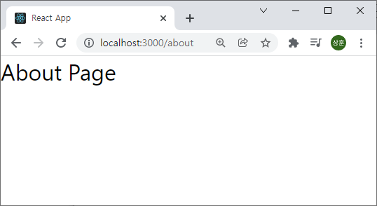
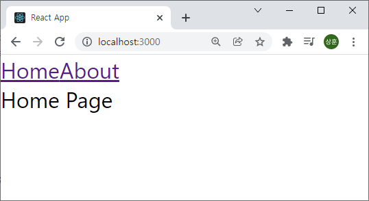
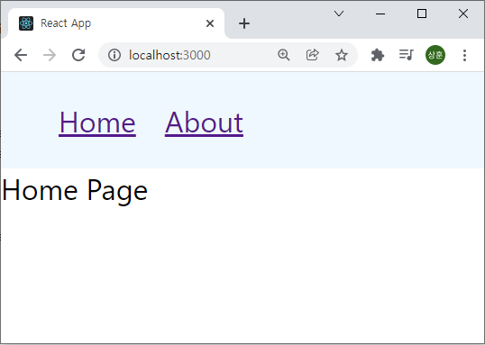
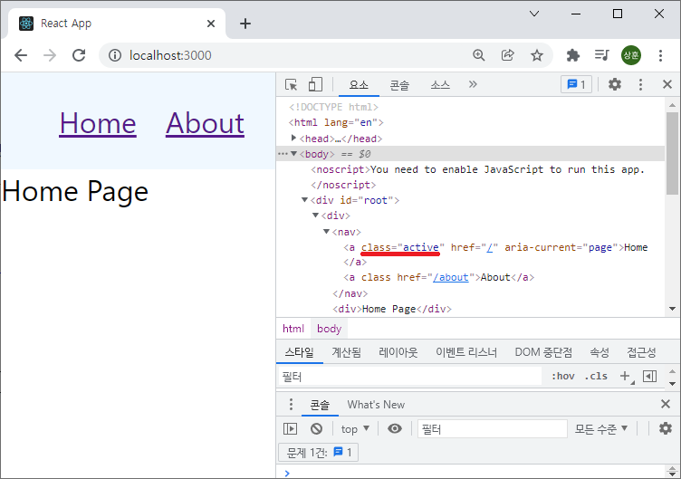
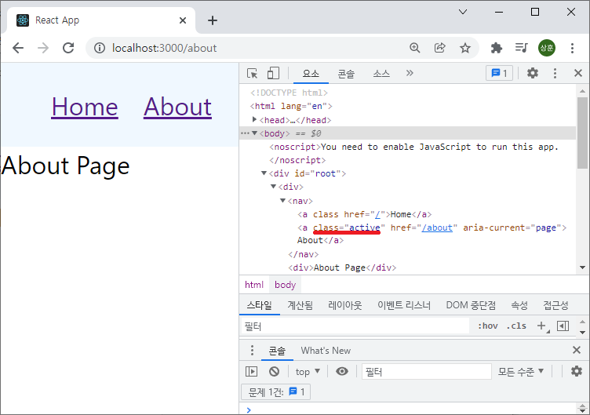
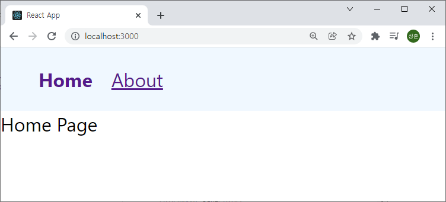
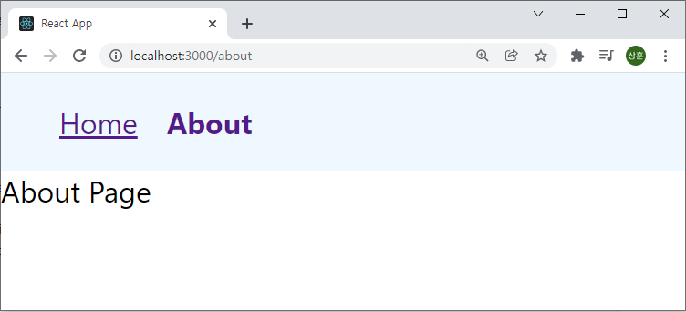

# React Router

React Router를 학습해 보자
참조 : [React Router Tutorial](https://www.youtube.com/playlist?list=PLC3y8-rFHvwjkxt8TOteFdT_YmzwpBlrG)


## 목차

1. [시작하기](#시작하기)
1. [라우터 구성](#라우터-구성)
1. [링크](#링크)


## 시작하기

먼저 `react-router-app` 이라는 이름의 React 앱을 설치하고 Router 또한 설치하자.

```bash
$ npx create-react-app react-router-app
$ cd react-router-app
$ yarn add react-router-dom@6 or npm install react-router-dom@6
```


## 라우터 구성

먼저 라우터를 구성해 보자. 여기선 `home`와 `about` 페이지로 구성해 보자. 먼저 해줘야 할 것이 하나 있다.

```javascript
// index.js
import { BrowserRouter } from 'react-router-dom'

...

ReactDOM.render(
  <React.StrictMode>
    <BrowserRouter>
      <App />
    </BrowserRouter>
  </React.StrictMode>,
  document.getElementById('root')
);

reportWebVitals();
```

위 코드를 통해 `BrowserRouter`에 `App` 컴포넌트를 포함 시켜 준다. 그리고 각 컴포넌트를 담고 있는 컴포넌트 폴더를 생성하여 주자.

```javascript
// Home.js
export const Home = () => {
  return <div>Home Page</div>
}

// About.js
export const About = () => {
  return <div>About Page</div>
}
```

그리고 `App.js`를 수정해 주자.

```javascript
// App.js

import { Routes, Route } from 'react-router-dom'
import { Home } from './components/Home'
import { About } from './components/About';

function App() {
  return (
    <Routes>
      <Route path='/' element={<Home/>}/>
      <Route path='about' element={<About/>}/>
    </Routes>
  );
}

export default App;
```

여기서 Route의 path는 뒤에 입력할 Url을 뜻하고 element는 보여줄 컴포넌트를 뜻한다.




## 링크

`Navbar`를 만들어 각 링크를 통해 원하는 페이지로 이동할 수 있도록 만들어 보자. 컴포넌트 폴더에 `Navbar.js`를 만들어 주자.

```javascript
// Navabr.js

import { Link } from 'react-router-dom'

export const Nabar = () => {
  return (
    <nav>
      <Link to='/'>Home</Link>
      <Link to='/about'>About</Link>
    </nav>
  )
};
```

nav에 `Link` 컴포넌트를 삽입한다. 여기서 `to` 속성은 이 링크를 통해 어느 페이지로 이동할 것인지를 뜻한다.

 ```javascript
 // App.js
 
 ...
 
 function App() {
   return (
     <div>
       <Navbar/>
       <Routes>
         <Route path='/' element={<Home/>}/>
         <Route path='/about' element={<About/>}/>
       </Routes>
     </div>
   );
 }
 ```

`App` 컴포넌트의 return 값을 `div` 태그로 묶고 `Navbar` 컴포넌트를 삽입하면 된다.



모양이 예쁘지 않으니 index.css에서 간단하게 수정해 주자.

```css
/* index.css */

...

nav {
  background-color: aliceblue;
  padding: 16px 32px;
}

nav a {
  margin-right: 16px;
}
```



훨씬 더 깔끔해 졌다.

활성화된 링크를 꾸며주기 위한 기능으로 `Navlink`을 사용할 수 있다.

```javascript
// Navbar.js

import { NavLink } from 'react-router-dom'

export const Navbar = () => {
  return (
    <nav>
      <NavLink to='/'>Home</NavLink>
      <NavLink to='/about'>About</NavLink>
    </nav>
  )
};
```

`Link`를 `NavLink`로 바꾸어 주면





이처럼 활성화된 링크를 확인할 수 있다. 이제 css를 수정하여 활성화된 링크를 알아볼 수 있게 해주자.



css를 사용하지 않고 Nabar 컴포넌트의 함수로 이를 다루어 보자.

```javascript
// Navbar.js

import { NavLink } from 'react-router-dom'

export const Navbar = () => {

  function navLinkStyles ({ isActive }) {
    return {
      fontWeight: isActive ? 'bold' : 'normal',
      textDecoration: isActive ? 'none' : 'underline'
    }
  }

  return (
    <nav>
      <NavLink style={navLinkStyles} to='/'>Home</NavLink>
      <NavLink style={navLinkStyles} to='/about'>About</NavLink>
    </nav>
  )
};
```



이도 똑같이 작용한다. 이렇게 `NavLink`를 사용하여 활성화된 링크를 다르게 보여주어 유저편의성을 증대 시킬 수 있다.
