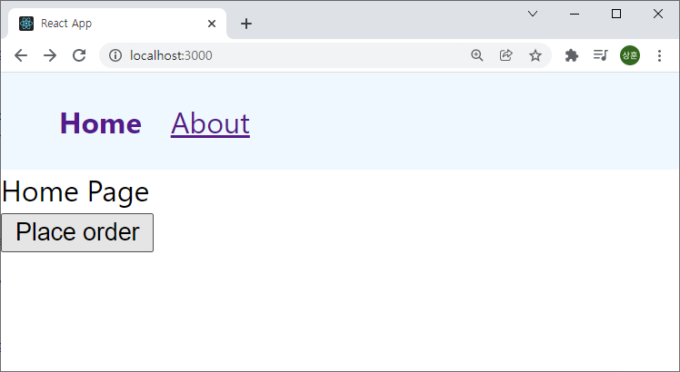
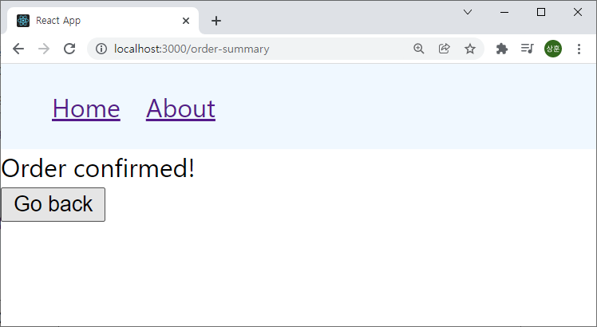
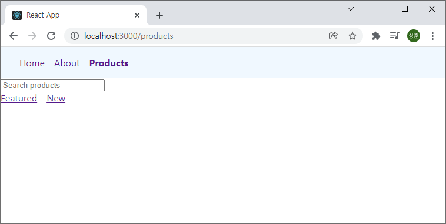
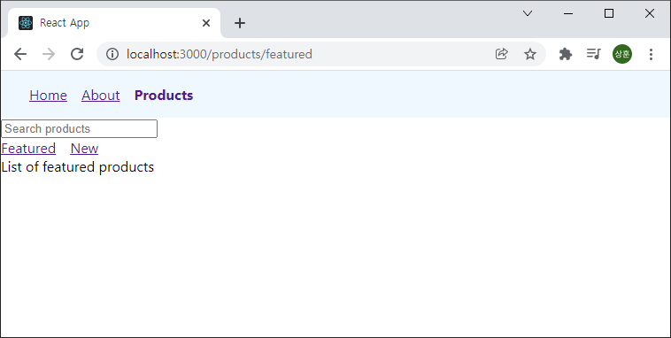
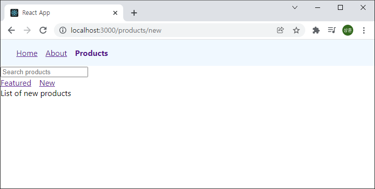
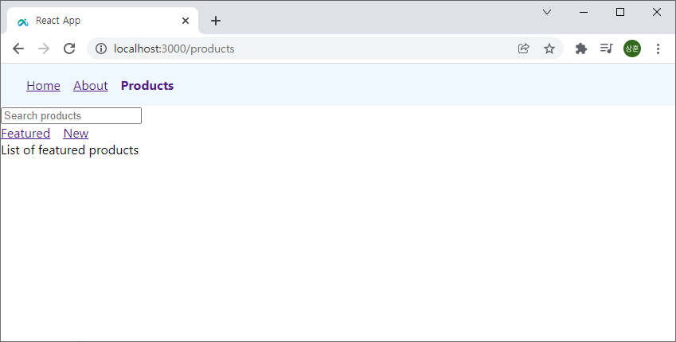
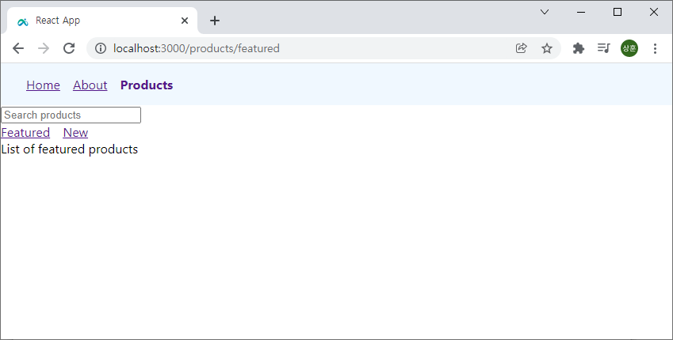

# React Router

React Router를 학습해 보자
참조 : [React Router Tutorial](https://www.youtube.com/playlist?list=PLC3y8-rFHvwjkxt8TOteFdT_YmzwpBlrG)


## 목차

1. [시작하기](#시작하기)
1. [라우터 구성](#라우터-구성)
1. [링크](#링크)
1. [프로그래밍 방식 네비게이션](#프로그래밍-방식-네비게이션)
1. [라우터가 없을 때](#라우터가-없을-때)
1. [중첩 라우터](#중첩-라우터)
1. [인덱스 라우터](#인덱스-라우터)


## 시작하기

먼저 `react-router-app` 이라는 이름의 React 앱을 설치하고 Router 또한 설치하자.

```bash
$ npx create-react-app react-router-app
$ cd react-router-app
$ yarn add react-router-dom@6 or npm install react-router-dom@6
```


## 라우터 구성

먼저 라우터를 구성해 보자. 여기선 `home`와 `about` 페이지로 구성해 보자. 먼저 해줘야 할 것이 하나 있다.

```javascript
// index.js
import { BrowserRouter } from 'react-router-dom'

...

ReactDOM.render(
  <React.StrictMode>
    <BrowserRouter>
      <App />
    </BrowserRouter>
  </React.StrictMode>,
  document.getElementById('root')
);

reportWebVitals();
```

위 코드를 통해 `BrowserRouter`에 `App` 컴포넌트를 포함 시켜 준다. 그리고 각 컴포넌트를 담고 있는 컴포넌트 폴더를 생성하여 주자.

```javascript
// Home.js
export const Home = () => {
  return <div>Home Page</div>
}

// About.js
export const About = () => {
  return <div>About Page</div>
}
```

그리고 `App.js`를 수정해 주자.

```javascript
// App.js

import { Routes, Route } from 'react-router-dom'
import { Home } from './components/Home'
import { About } from './components/About';

function App() {
  return (
    <Routes>
      <Route path='/' element={<Home/>}/>
      <Route path='about' element={<About/>}/>
    </Routes>
  );
}

export default App;
```

여기서 Route의 path는 뒤에 입력할 Url을 뜻하고 element는 보여줄 컴포넌트를 뜻한다.


## 링크

`Navbar`를 만들어 각 링크를 통해 원하는 페이지로 이동할 수 있도록 만들어 보자. 컴포넌트 폴더에 `Navbar.js`를 만들어 주자.

```javascript
// Navabr.js

import { Link } from 'react-router-dom'

export const Nabar = () => {
  return (
    <nav>
      <Link to='/'>Home</Link>
      <Link to='about'>About</Link>
    </nav>
  )
};
```

nav에 `Link` 컴포넌트를 삽입한다. 여기서 `to` 속성은 이 링크를 통해 어느 페이지로 이동할 것인지를 뜻한다.

 ```javascript
 // App.js
 
 ...
 
 function App() {
   return (
     <div>
       <Navbar/>
       <Routes>
         <Route path='/' element={<Home/>}/>
         <Route path='about' element={<About/>}/>
       </Routes>
     </div>
   );
 }
 ```

`App` 컴포넌트의 return 값을 `div` 태그로 묶고 `Navbar` 컴포넌트를 삽입하면 된다.


모양이 예쁘지 않으니 index.css에서 간단하게 수정해 주자.

```css
/* index.css */

...

nav {
  background-color: aliceblue;
  padding: 16px 32px;
}

nav a {
  margin-right: 16px;
}
```


훨씬 더 깔끔해 졌다.

활성화된 링크를 꾸며주기 위한 기능으로 `Navlink`을 사용할 수 있다.

```javascript
// Navbar.js

import { NavLink } from 'react-router-dom'

export const Navbar = () => {
  return (
    <nav>
      <NavLink to='/'>Home</NavLink>
      <NavLink to='about'>About</NavLink>
    </nav>
  )
};
```

`Link`를 `NavLink`로 바꾸어 주면


이처럼 활성화된 링크를 확인할 수 있다. 이제 css를 수정하여 활성화된 링크를 알아볼 수 있게 해주자.


css를 사용하지 않고 Nabar 컴포넌트의 함수로 이를 다루어 보자.

```javascript
// Navbar.js

import { NavLink } from 'react-router-dom'

export const Navbar = () => {

  function navLinkStyles ({ isActive }) {
    return {
      fontWeight: isActive ? 'bold' : 'normal',
      textDecoration: isActive ? 'none' : 'underline'
    }
  }

  return (
    <nav>
      <NavLink style={navLinkStyles} to='/'>Home</NavLink>
      <NavLink style={navLinkStyles} to='/about'>About</NavLink>
    </nav>
  )
};
```


이도 똑같이 작용한다. 이렇게 `NavLink`를 사용하여 활성화된 링크를 다르게 보여주어 유저편의성을 증대 시킬 수 있다.


## 프로그래밍 방식 네비게이션

지금까지 사용했던 선언형 방식이 아닌 프로그래밍 방식으로도 라우터를 사용할 수 있다. 한번 시도해 보자.

먼저 OrderSummary 컴포넌트를 생성하여 각 컴포넌트를 아래와 같이 작성해 보자.

```javascript
// App.js
function App() {
  return (
    <div>
      <Navbar/>
      <Routes>
      
      	...
      
        <Route path='order-summary' element={<OrderSummary/>}/>
      </Routes>
    </div>
  );
}

// Home.js

import { useNavigate } from 'react-router-dom'

export const Home = () => {
  const navigate = useNavigate()
  return (
    <div>
      <div>Home Page</div>
      <button onClick={() => navigate('order-summary')}>Place order</button>
    </div>
  )
}

// OrderSummary.js

import { useNavigate } from 'react-router-dom'

export const OrderSummary = () => {
  const navigate = useNavigate()
  return (
    <div>
      <div>Order confirmed!</div>
      <button onClick={() => navigate(-1)}>Go back</button>
    </div>
  )
};
```

먼저 `App.js`에 우리가 추가할 `OrderSummary` 라우터를 작성하였다. 그리고 `Home`에는 `useNavgate`를 import하고 `Place order`버튼을 클릭하였을 때 `order-summary`라우터로 이동하도록 하였다. 이 때 navigate를 class형 함수로 선언하여 사용하였다.

마찬가지로 `OrderSummary`또한 비슷하게 작성하는데 `navigate`의 인자로 `-1`을 입력하였다. 이는 온 곳으로 되돌아가라는 명령어 이다. 따라서 아래와 같이 이동하게 된다.






## 라우터가 없을 때

웹사이트를 탐색하는 경우 페이지를 찾을 수 없습니다와 같은 오류를 출력하는 페이지를 본적이 있을 것이다. 이러한 페이지를 한번 만들어 보자. `NoMatch` 컴포넌트를 생성하여 이를 표현하자.

```javascript
// App.js

function App() {
  return (
    <div>
      <Navbar/>
      <Routes>

      	...
      
        <Route path='*' element={<NoMatch/>}/>
      </Routes>
    </div>
  );
}

// NoMatch.js

export const NoMatch = () => {
  return <div>Page not found</div>;
};

```

라우터의 경로에 `*`의 의미는 라우터가 존재하지 않을 때를 의미한다. 우리가 의도한 바와 일치하다. 이때 한번 존재하지 않는 라우터로 이동해 보자. 아래와 같은 결과를 얻을 것이다.


## 중첩 라우터

`중첩 라우터(Nested Routes)`는 라우터로 이동한 곳에서 또 라우터를 사용하여 다른 곳으로 이동하는 기능을 뜻한다. 먼저 `products` 컴포넌트를 작성해 보자.

```javascript
// Products.js

import { Link } from 'react-router-dom'

export const Products = () => {
  return (
    <div>
      <div>
        <input type='search' placeholder='Search products'/>
      </div>
      <nav>
        <Link to='featured'>Featured</Link>
        <Link to='new'>New</Link>
      </nav>
    </div>
  );
};

// App.js

function App() {
  return (
    <div>
      <Navbar/>
      <Routes>

      	...
      
        <Route path='products' element={<Products/>}/>
      </Routes>
    </div>
  );
}

// Navbar.js

  return (
    <nav>
		
      ...
      
      <NavLink style={navLinkStyles} to='/products'>Products</NavLink>
    </nav>
  )
```

`Link` 컴포넌트를 사용하여 `feature`와 `new`로 이동할 수 있도록 하였다. 이전에 했던 방식이므로 자세한 설명은 생략한다. 그리고 최상단의 `navbar`에 차이점을 주기 위해 `index.css`를 변경시켜 주자.

```css
/* index.css */

.primary-nav {
  background-color: aliceblue;
  padding: 16px 32px;
}
```

```javascript
// Navbar.js

  return (
    <nav className='primary-nav'>
      
      ...
      
    </nav>
  )
```


이제 `featured`와 `new` 컴포넌트를 만들어주자.

```javascript
// FeaturedProducts.js

export const FeaturedProducts = () => {
  return <div>List of featured products</div>;
};

// NewProducts.js

export const NewProducts = () => {
  return <div>List of new products</div>;
};
```


그리고 `App.js`와 `Products.js`를 변경해 주자.

```javascript
// App.js

function App() {
  return (
    <div>
      <Navbar/>
      <Routes>
      
		...
      
        <Route path='products' element={<Products/>}>
          <Route path='featured' element={<FeaturedProducts/>}/>
          <Route path='new' element={<NewProducts/>}/>
        </Route>
      </Routes>
    </div>
  );

// Products.js

import { Link, Outlet } from 'react-router-dom'

export const Products = () => {
  return (
    <div>
      <div>
        <input type='search' placeholder='Search products'/>
      </div>
      <nav>
        <Link to='featured'>Featured</Link>
        <Link to='new'>New</Link>
      </nav>
      <Outlet/>
    </div>
  );
};
```

`App.js`를 보면 `products` 라우터 안에 다른 라우터들을 중첩시켜 보여 줄 수 있도록 하였다. 여기서 그치면 안되고, `Products.js`에 `Outlet`이라는 중첩 라우팅 요소를 보여주는 속성을 import해 주어야 한다.








## 인덱스 라우터

위의 중첩 라우터를 사용했을 때 `product`를 누르면 아무 내용도 보이지 않는다. 이를 보완하기 위해 처음 라우터로 이동하였을 때 보여줄 내용을 결정하는 것을 `인덱스 라우터(index route)` 라고 한다.

```javascript
// App.js

function App() {
  return (
    <div>
      <Navbar/>
      <Routes>
        
      	...
      
        <Route path='products' element={<Products/>}>
          <Route index element={<FeaturedProducts/>}/>
          <Route path='featured' element={<FeaturedProducts/>}/>
          <Route path='new' element={<NewProducts/>}/>
        </Route>
        <Route path='*' element={<NoMatch/>}/>
      </Routes>
    </div>
  );
}
```

간단하게 `product` 라우터에 `Route` 컴포넌트를 추가하고 속성값으로 `path` 대신 `index`를 주었다. 간단하게 인덱스 라우터를 만들 수 있다.




